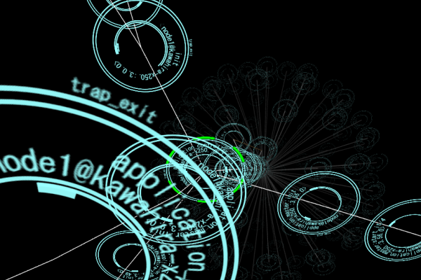

# Erlang process visualizer

ErlangのプロセスをWebGLで表示するWebアプリです．

RubyからErlangのノードに[Distribution Protocol](http://www.erlang.org/doc/apps/erts/erl_dist_protocol.html)で接続してRPCしたりします．
プロトコルの勉強ついでに作ったやつなので実用性は皆無です．

